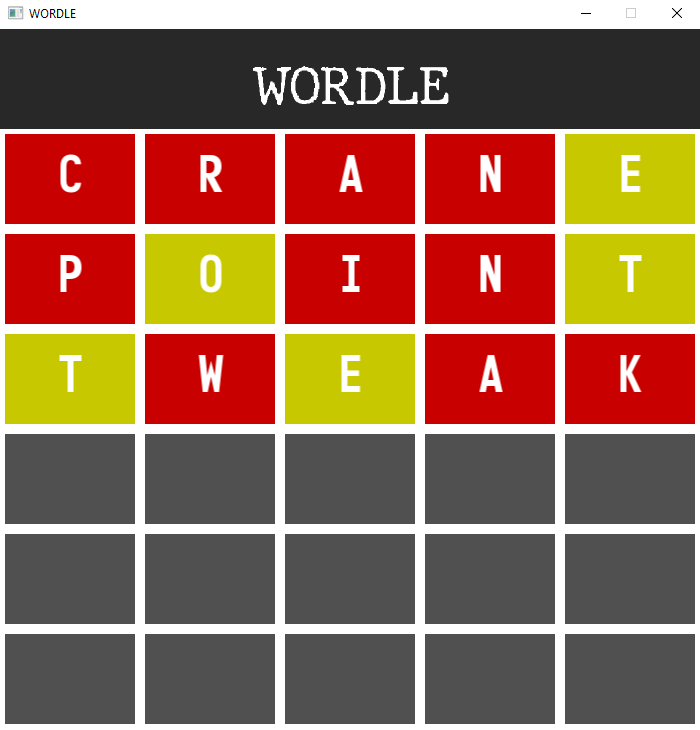
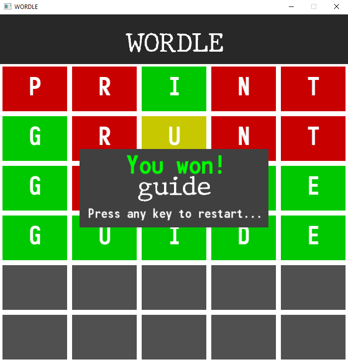
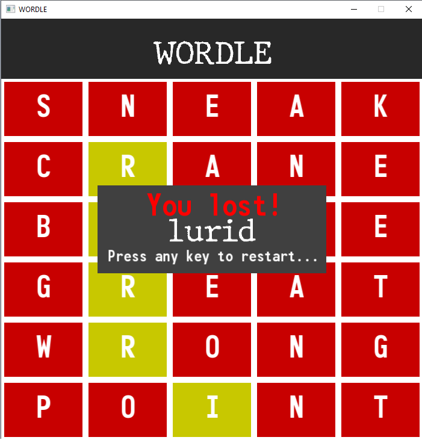

# Overall
## Description
Simple WORDLE game inspired by the version currently available at the NY Times website : https://www.nytimes.com/games/wordle/index.html
## How to play yourself?
In order to launch the game :
1. Download / copy the repository to your Windows device
2. Open the ForDistribution directory
3. Launch .exe file
## Environment
The project was created using C++ (20) with help of the SFML (*Simple and Fast Media*) library. The IDE I used was Microsoft Visual Studio Community Edition.
The end product works on the **Windows** operating system.
## Assets
Fonts are free for all purposes of use and were downloaded from dafont.com
## Features
The user starts with 6 chances to guess a randomly chosen word from the list of words available in the resources (ForDistribution/resources/validwords.txt) folder.

After choosing a word to guess, typing it in and confirming the input by pressing *Enter* the squares with letters are colored correspondingly to indicate whether the letter was  : 
- not present in the answer word - **Red**
- present in the answer word however in a different position - **Yellow** 
- present in the answer word in this exact position - **Green**

After the user inputs the correct word or runs out of attempts, the end game screen is shown revealing the word that was to be guessed and informs the user that a new game can be started by a press of any key.

**Here are example screenshots of the game :**

